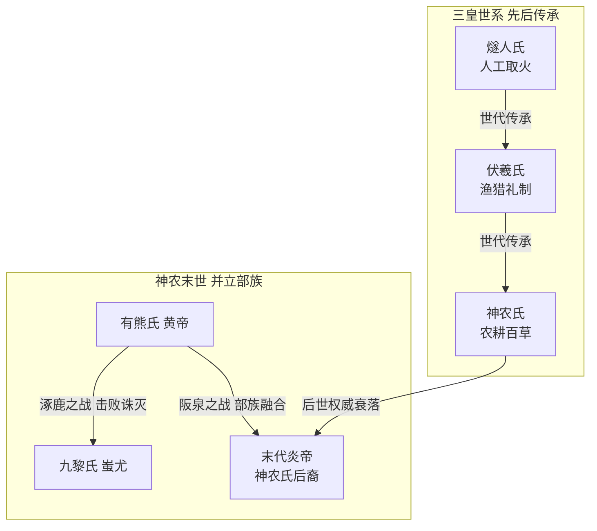
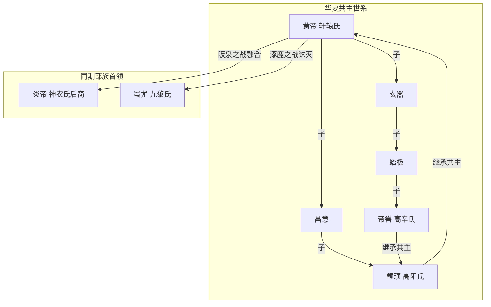
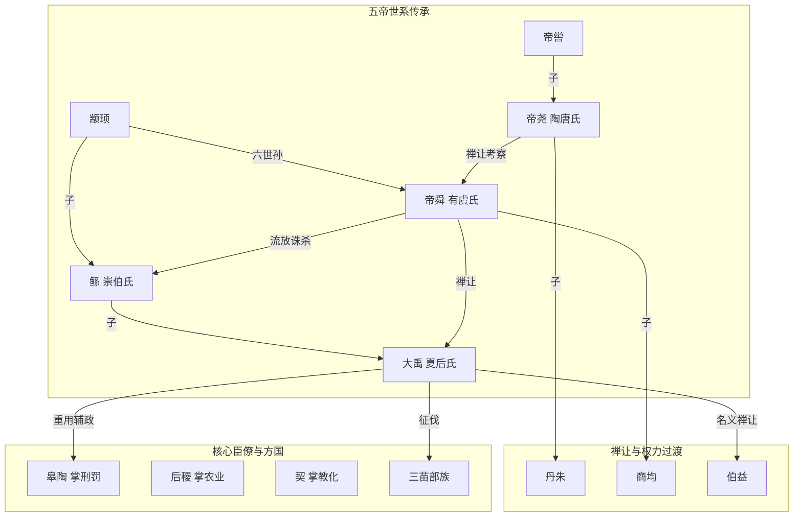

# 三皇时代

> 约公元前 6000 年 — 公元前 3000 年

## 主要人物关系

## 故事简述

三皇并非单一真实历史人物，而是先秦两汉文献对上古文明演进阶段的人格化总结，是官方历史叙事中中华文明起源的标志性符号，其记载散见于《周易・系辞》《尚书大传》《帝王世纪》等典籍。

燧人氏是传说中最早的共主，核心功绩是发明钻木取火，教民众熟食，结束了远古人类茹毛饮血的状态，对应旧石器时代晚期到新石器早期的用火革命。伏羲氏继之而起，教民众结网捕鱼、驯养牲畜，推动渔猎经济发展；同时画八卦、定嫁娶之礼、造书契，开启了早期礼制与符号记事，是华夏人文精神的源头。

神农氏（炎帝）是三皇时代的最后一位共主，标志着农耕文明的全面确立。传说他亲尝百草，识别药物与可食用作物，发明耒耜等农耕工具，教民众种植五谷，奠定了中国农业文明的基础；又设立 “日中为市” 的早期交易制度，推动了原始商业萌芽。神农氏部族以渭水流域为核心，是当时中原规模最大的农耕部落联盟，后世 “炎黄子孙” 的称谓即源于此。

到神农氏末世，部落联盟权威衰落，各地邦国相互攻伐，民众饱受战乱之苦，神农氏无力约束。此时兴起于嵩山周边的有熊氏部落，在首领黄帝的带领下逐渐强大，最终通过战争整合各部，开启了五帝时代。

**考古与学术依据**：

- 河南新郑裴李岗遗址（距今约 8000-7000 年）发现了中国最早的粟作农业遗存、磨制石器与彩陶，证实当时已进入定居农耕社会，对应神农氏农耕起源的传说阶段。
- 陕西西安半坡遗址、临潼姜寨遗址（仰韶文化早期，距今约 7000-6000 年）呈现出规模完整的氏族聚落、公共墓地与祭祀遗迹，反映了早期部落联盟的社会结构，是三皇时代的核心考古实证。
- 该阶段是中华文明探源工程明确的 “文明起源奠基阶段”，人教版统编历史教材将其纳入 “远古的传说” 与 “原始农耕生活” 核心章节，为官方正式认定的历史叙事。

# 五帝前期

> 约公元前 3000 年 — 公元前 2300 年

## 主要人物关系

## 故事简述

本阶段为《史记・五帝本纪》记载的前三位帝王，对应考古学上的仰韶文化晚期到庙底沟二期文化，是华夏部落联盟正式形成、早期国家形态萌芽的关键时期，距今约 5000-4300 年，即官方常说的 “中华文明五千年” 的起点。

黄帝名轩辕，是有熊氏部落首领。面对神农氏衰微、诸侯混战的局面，他整顿武备，先后在阪泉之野与炎帝部落展开三次大战，最终击败炎帝，两大部落深度融合，形成华夏族的核心主体，后世 “炎黄子孙” 的认同即由此奠定。随后，东夷九黎部落在蚩尤带领下西进中原，黄帝联合华夏各部，在涿鹿之战中击败并诛杀蚩尤，将联盟势力扩展到黄河下游与江淮地区，成为天下公认的共主。

黄帝统一后，建立了初具规模的联盟治理体系：设左右大监监察四方诸侯，命仓颉整理创制文字，令大挠制定干支历法，嫘祖（黄帝正妃）教民众养蚕缫丝，同时统一度量衡、建造宫室舟车，奠定了华夏文明的基本制度与文化底色，因此被尊为 “人文初祖”。

黄帝之后，其孙颛顼（高阳氏）继位。颛顼最大的功绩是 “绝地天通”：针对当时家家祭祀、人人通神的混乱局面，设立专门的祭司阶层垄断祭祀与通天权力，将宗教神权收归共主统一管理，从意识形态上强化了联盟的集权属性，是早期国家形成的重要标志。他还大幅拓展了联盟疆域，北到幽陵、南到交趾、西到流沙、东到蟠木，各方国部落纷纷归附。

颛顼之后，黄帝的曾孙帝喾（高辛氏）继位。帝喾以仁德治国，史载其 “明民共财，知民之急”，从不盘剥民众；他进一步完善天文历法，根据日月运行规律修正四时节气，更精准地指导农业生产，使社会经济稳定发展，部落联盟的凝聚力持续增强。

**考古与学术依据**：

- 河南灵宝铸鼎原遗址群（距今约 5000 年，庙底沟文化核心区）发现了面积近百万平方米的中心聚落、高等级墓葬、人工铜渣与祭祀遗迹，与传说中 “黄帝铸鼎于荆山” 的地望、时代高度吻合，是中华文明探源工程认定的 “黄帝时代” 核心遗存。
- 庙底沟文化彩陶以极快的速度传播至大半个中国，覆盖黄河、长江两大流域，形成了前所未有的文化认同圈，对应黄帝时期华夏联盟的文化影响力扩张，学界称之为 “早期中国文化圈” 的形成。
- 河南濮阳西水坡遗址的蚌塑龙虎墓（距今约 6400 年），展现了成熟的天文观测体系与专门的祭祀阶层，为颛顼 “绝地天通” 的宗教改革提供了考古背景支撑。
- 本阶段世系与史事为《史记》正史记载，是官方认定的 “五帝时代” 核心内容，国内所有历史教材与公共文化场所均采用此叙事体系。

# 五帝后期

> 约公元前 2300 年 — 公元前 2070 年

## 主要人物关系

## 故事简述

本阶段是五帝时代的收官阶段，也是部落联盟向世袭王朝过渡的最后时期，对应考古学上的中原龙山文化晚期，最终由大禹完成王朝奠基，其子启建立夏朝。

帝尧名放勋，号陶唐氏，定都平阳。他是上古贤君的典范，在位期间命羲氏、和氏分赴四方观测星象，测定一年为 366 天，以闰月调整四时，正式确立了系统的农耕历法，史称 “敬授民时”。同时建立了四岳议事制度，重大事务由四方部落首领共同商议，形成了成熟的邦国联盟决策机制。

尧统治后期，中原遭遇持续性特大洪水，民众被迫迁往高地，生活困苦。经四岳举荐，尧命崇伯鲧主持治水。鲧采用筑堤堵截的方法治理九年，不仅未能平息水患，反而因堤防溃决造成更大灾害。晚年尧没有将共主之位传给品行顽劣的儿子丹朱，而是经四岳推荐，选拔出身寒微但以孝闻名的舜作为继承人，通过嫁女考察、政务历练等长达二十年的考验后，正式禅位于舜，开创了 “公天下” 的禅让制传统。

帝舜名重华，号有虞氏，是颛顼的远支后裔。摄政与在位期间，他对联盟体系进行了全面的制度化改革：设立九官分掌政务，以禹为司空治水，后稷管农业，契管教化，皋陶管刑罚，伯益管山林畜牧，构建了中国历史上第一套完整的职官体系；同时统一度量衡与礼乐刑罚，建立五年一巡守的朝贡制度，将天下划分为十二州，强化了对地方方国的管控。为整肃秩序，他将作乱的共工流放幽陵、驩兜流放崇山、三苗迁徙三危、鲧诛杀于羽山，史称 “流四罪而天下咸服”，共主的权威得到空前加强。

晚年舜效仿尧，没有传位给才能平庸的儿子商均，将共主之位禅让给治水立下盖世之功的大禹。传说舜晚年南巡，崩于苍梧之野，葬于九嶷山，留下了湘妃竹的千古传说。

大禹继位后，改堵为疏，历时十三年走遍九州，疏通河道、修筑堤防，平定了持续数十年的水患，期间 “三过家门而不入”，在各部族中建立了无与伦比的威望。治水过程中，他打破部落血缘界限，按山川地理将天下划分为冀、兖、青、徐、扬、荆、豫、梁、雍九州，建立了按地域管理民众的行政雏形；又收集天下青铜铸造九鼎，象征九州一统，九鼎从此成为王权正统的核心信物。随后禹南征三苗，将华夏势力扩展到江汉流域；又在涂山召集天下万邦首领会盟，史称 “涂山之会”，标志着夏后氏已成为绝对的统治核心，世袭王朝的基础已完全奠定。

禹晚年名义上推举伯益为继承人，但始终将实权交给儿子启，培植夏后氏势力。禹死后，启凭借强大的部族实力诛杀伯益，击败反对世袭制的有扈氏，正式建立夏王朝，中国历史从此进入 “家天下” 的世袭王权时代。

**考古与学术依据**：

- 山西襄汾陶寺遗址（距今约 4300-3900 年）是中原龙山时代规模最大的都邑，面积达 280 万平方米，发现了中国最早的观象台、中轴线宫殿建筑群、王级大墓、朱书文字与铜礼器，学界主流与官方均认定其为帝尧都城 “平阳”，证实当时已进入成熟的早期国家形态。
- 河南登封王城岗遗址发现了龙山晚期的大小两座城址，小城对应 “鲧作城”，大城为禹都阳城，是夏后氏部族兴起的核心实证，为夏商周断代工程重点确认成果。
- 安徽蚌埠禹会村遗址发现了距今 4100 年左右的大型祭祀会盟台基，出土了来自中原、海岱、江淮等不同文化区的陶器，与 “禹会诸侯于涂山” 的记载高度吻合。
- 本阶段是夏商周断代工程与中华文明探源工程的核心研究范畴，其年代框架、史事体系为国内官方正式采用，是夏朝建立前的直接历史铺垫。