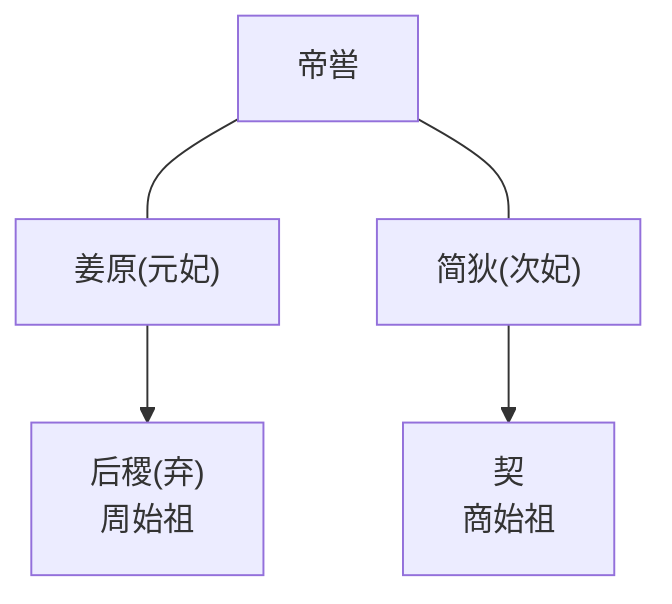
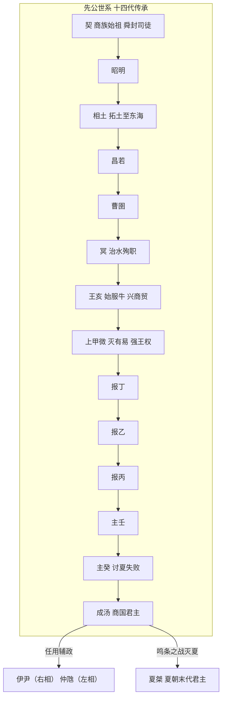
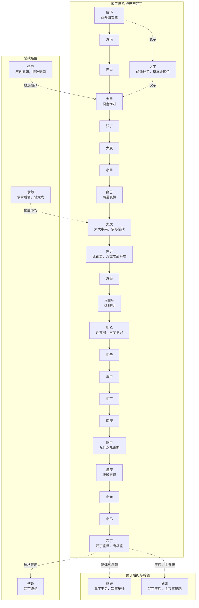
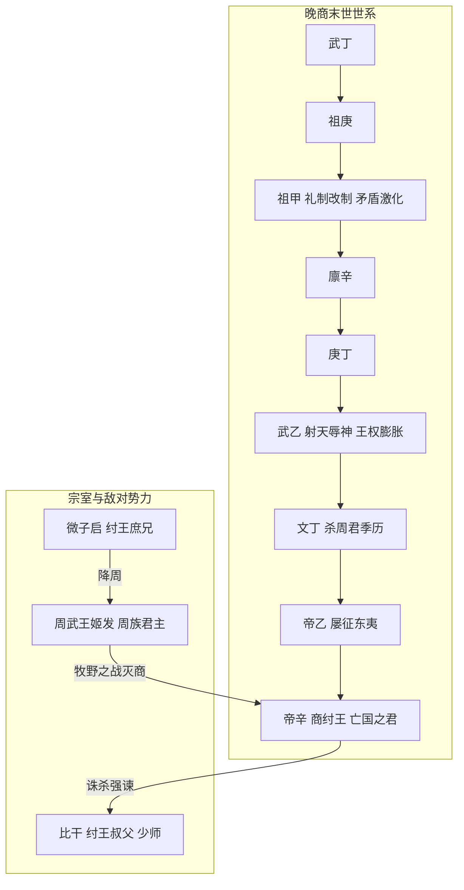

# 奠基

> 约公元前 21 世纪 — 公元前 1600 年

## 主要人物关系

> 与周朝关系

## 故事简述

起源：
商族是兴起于黄河下游的古老部族，相传为帝喾后裔，始祖契因辅佐大禹治水有功，被舜任命为司徒，封于商地，商族由此得名

先公时期，商族文明持续进阶：
**相土**驯服==马==、牛、羊、猪、狗、鸡（六畜），拓展疆域，势力直达东海之滨
冥担任水官，因治水殉职于黄河，受到后世隆重祭祀
**王亥**==驯服牛群，开创长途商贸贸易==，“**商人**”“**商业**” 的称谓即源于此。后王亥被有易氏首领谋害，其子上甲微率军攻灭有易氏，强化了部族军事权力与首领权威，商族开始形成早期国家形态

**主癸**讨夏，遇到皋改革夏朝，失败

**成汤**（成为商族首领，他将都城迁至==亳==（今河南郑州一带，==更靠近夏都==），广施仁政（==网开一面典故==）、收拢人心，破格任用出身低微的==伊尹、仲虺（huī）==为左右相
当时夏桀暴虐无道，民众怨声载道，==成汤以 “天命诛暴” 为号召==，先后攻灭夏朝的核心属国葛、韦、顾、昆吾

夏桀忌惮商朝势力，在成汤献贡将他囚禁于夏台（后被释放），导致其它国更加害怕夏

约公元前 1600 年，商汤率军与夏桀主力在==鸣条之野==展开决战，夏军大败，桀流亡南巢而死，夏朝灭亡
成汤大会诸侯于亳，正式建立商王朝

# 繁荣

> 约公元前 1600 年 — 公元前 1192 年

## 主要人物关系

## 故事简述

确立了内外服的国家治理体系：
王畿以内为内服，由商王直接委派官吏管理
王畿以外的方国部落为外服，通过朝贡、册封维持隶属关系

成汤去世后，**因长子太丁早逝，由太丁之子太甲继位**：
太甲初期放纵暴虐、破坏祖制，辅政大臣==伊尹将其放逐至桐宫思过，自己代行王权==
==三年后太甲悔过自新，伊尹迎其复位，太甲此后勤政修德，诸侯归附，百姓安宁，史称 “太宗中兴”==

**九世之乱**：
没有确立 “==嫡长子唯一继承权==”，合法继承人不止一个，导致争权
商中央集权弱，王族力量大，也会争权

内乱胜利者上台后，旧都城盘踞大量失败的王族旧势力，隐患巨大，通过==频繁迁都==躲避王族内部政敌、削弱反对派

# 衰落

> 约公元前 1192 年 — 公元前 1046 年

## 主要人物关系

## 故事简述

武丁去世后，商朝由盛转衰：
**祖甲**在位：
==礼制改革；继承制度类似嫡长子继承制，但没有形成成文规定；收紧祭祀权限、削弱贵族特权==
激化了王室与贵族、神权阶层的矛盾，统治集团内部出现分裂（==不改则死，改则乱==）

**廪辛、庚丁**两代，商朝对西方羌方的战争持续消耗国力，而渭水流域的周族开始逐步崛起

**武乙**在位时期，王权与神权的冲突彻底爆发：
武乙试图打破巫祝阶层对神权的垄断，做出 “==射天==” 的惊世之举

**文丁**继位后，忌惮周族的扩张，设计==杀害周族首领季历，商周矛盾彻底结下==

**帝乙**时期，商朝将军事重心转向东方，==多次大规模征伐东夷==，虽拓土至江淮，但长期战争耗尽了王朝国力，也造成了西方防御的空虚

**帝辛**继位：
继续对东夷用兵，彻底==平定了东夷叛乱==，将商朝疆域拓展至东南沿海
后期骄奢暴虐，大兴土木==修建鹿台、酒池肉林，加重赋税与刑罚==
打压宗室贵族，==杀害强谏的叔父比干==，==囚禁箕子，庶兄微子启被迫出逃==，统治集团分崩离析

约公元前 1046 年，**周武王**率领诸侯联军，趁商军主力滞留东夷、都城空虚之际，挥师东进，帝辛在==牧野==迎战周军
商军倒戈，周军直捣殷都，帝辛见大势已去，==登上鹿台自焚而死==，享国五百余年的商王朝就此灭亡
周武王建立周朝，封纣王之子武庚于殷地，后又封微子启于宋国，延续商族祭祀
