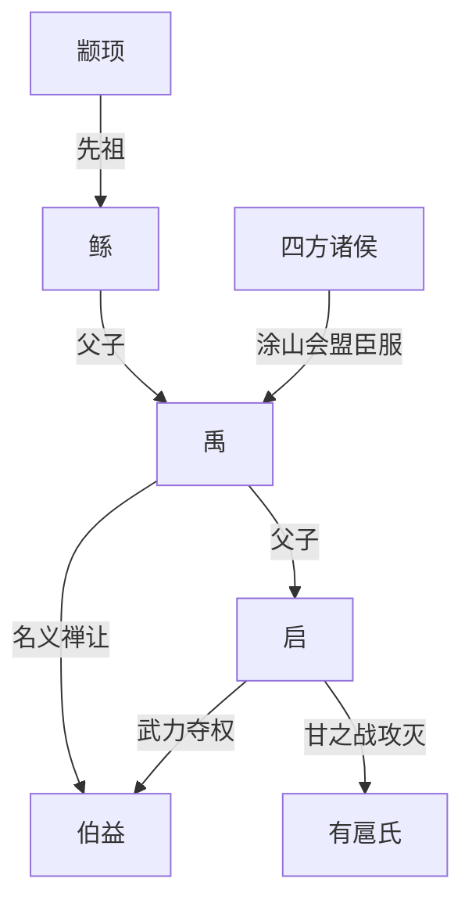
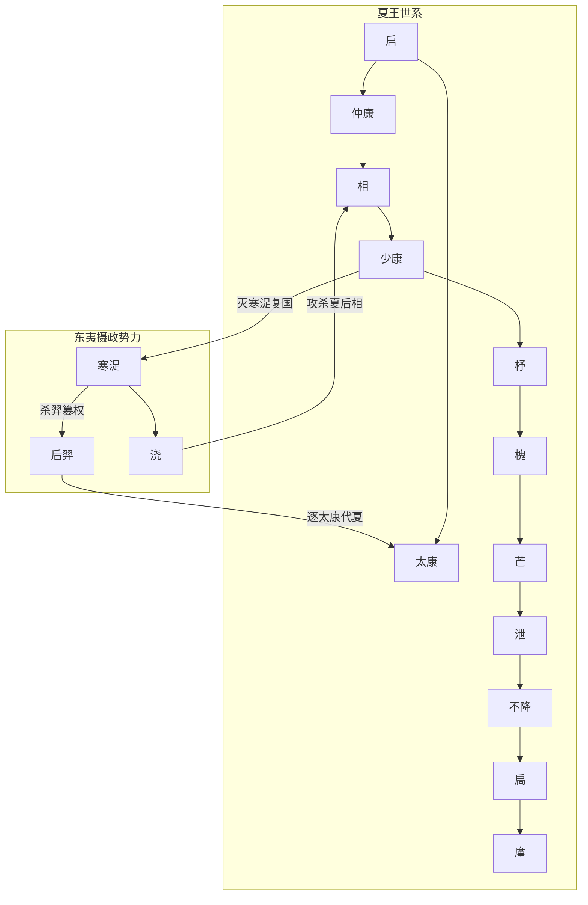
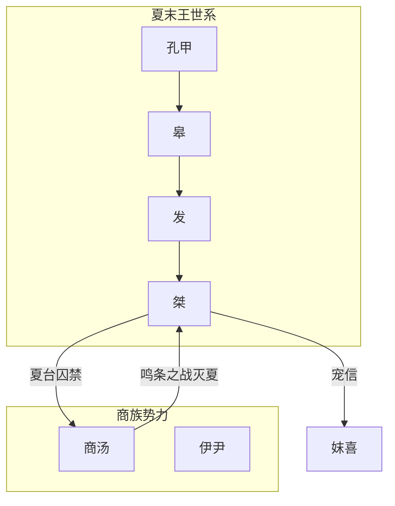

#  奠基

> 约公元前 21 世纪 - 公元前 2070 年

## 主要人物关系

## 故事简述

夏部族源自黄帝颛顼一脉，早期活动于嵩山周边的颍水流域。尧舜时期，中原洪水泛滥，禹的父亲鲧受命治水，因采用堵截之法九年无功，被舜诛杀于羽山。

禹继承治水事业，改堵为疏，历时十三年疏通河道、平定水患，期间 “三过家门而不入”，在各部族中建立了极高威望。治水成功后，禹又率军征讨三苗，将夏部族的势力扩展到江汉流域，成为部落联盟的实际核心。

为巩固共主地位，禹在涂山召集天下部落首领举行盟会，史称 “涂山之会”，上万部落首领携带玉帛朝贡，正式承认禹的天下共主身份，这一事件被视为夏王朝雏形形成的标志。考古发现的**安徽蚌埠禹会村遗址**，为距今 4100 年左右的大型礼仪祭祀台基，出土了来自中原、海岱、江淮等多地风格的陶器，与 “禹会诸侯” 的文献记载高度吻合，是目前唯一经考古发掘实证的 “禹迹”封面新闻。

禹建都于阳城（今河南登封王城岗遗址），该遗址发现了距今 4000 年左右的大型城址、铸铜遗存与高等级礼器，学界主流认定其为 “禹都阳城”，小城对应 “鲧作城”，大城为禹时期的都城抖音百科。

禹晚年按禅让制推举皋陶为继承人，皋陶早逝后又推举伯益。但禹死后，其子启凭借夏部族的强大实力，诛杀伯益夺取王位，又在甘之战中击败反对世袭制的有扈氏，彻底废除禅让制，确立了 “父传子、家天下” 的世袭王朝体制。约公元前 2070 年，夏王朝正式建立，中国历史从部落联盟时代进入世袭王权时代。

# 繁荣

> 约公元前 2070 年 - 公元前 17 世纪

## 主要人物关系

## 故事简述

夏启死后，其子太康继位。太康沉迷游猎、荒废政事，长期外出狩猎不归，导致朝政空虚。东夷有穷氏首领后羿趁机起兵，攻占夏都，驱逐太康，史称 “太康失国”。后羿立太康之弟仲康为傀儡夏王，实际掌控朝政；仲康死后，其子相继位，不久被后羿驱逐，后羿正式取代夏政。

后羿掌权后同样沉迷田猎，将政务托付给亲信寒浞。寒浞暗中培植势力，最终杀后羿夺权，还派儿子浇攻杀了流亡的夏后相，几乎将夏王室后裔斩尽杀绝。

相的妻子后缗当时怀有身孕，从墙洞逃出，回到娘家有仍氏，生下遗腹子少康。少康长大后，在有虞氏的帮助下积蓄力量，收拢夏部族遗民，最终联合各方势力击败寒浞，恢复了夏王朝的统治，史称 “少康中兴”，这是中国历史上第一次有记载的 “中兴” 事件。

考古层面，**河南新密新砦遗址**完美对应这段动荡历史：遗址地层呈现 “龙山晚期 - 新砦期 - 二里头早期” 三叠层结构，新砦期遗存中出现大量东夷文化风格的器物，与后羿、寒浞代表的东夷势力入主中原的记载高度契合，填补了夏初百年的考古空白。

少康之后，其子杼继位。杼重视军事与手工业，发明了甲胄，率军东征东夷，将夏朝疆域扩展到东海之滨，彻底巩固了夏王朝对东方的控制。从杼开始，夏朝进入稳定发展的鼎盛阶段：

- 槐在位时，九夷部落前来朝贡，夏朝影响力达到江淮流域；
- 芒在位时，举行大规模河祭，确立了王朝祭祀制度；
- 泄在位时，正式册封九夷爵位，建立了稳定的方国朝贡体系；
- 不降在位时，夏朝疆域达到极盛，北到山西南部，南到江汉，东到海滨，西到关中东部，是夏朝国力最强盛的时期。

这一鼎盛阶段对应考古学上的**二里头文化一至三期**（约公元前 1750 - 前 1600 年）。二里头遗址作为夏朝中晚期都城，面积达 300 万平方米，发现了中国最早的中轴线宫殿建筑群、最早的青铜礼器群、最早的官营铸铜作坊，以及象征王权的绿松石龙形器（“华夏第一龙”），标志着中国早期国家形态的完全成熟，是公认的 “华夏第一王都”抖音百科。

# 灭亡

> 约公元前 17 世纪 - 公元前 1600 年

## 主要人物关系

## 故事简述

夏朝的衰落始于孔甲在位时期。孔甲迷信鬼神、荒淫无道，史载 “孔甲乱夏，四世而陨”。传说孔甲喜好养龙，曾命刘累为其驯养龙，因龙死惧罪逃亡，这就是 “孔甲养龙” 的典故。孔甲时期，夏王室对各方国的控制力大幅下降，诸侯纷纷叛离，夏朝由盛转衰。

孔甲之后，皋、发两代夏王在位时间较短，未能扭转颓势。到发之子桀继位时，夏朝统治已摇摇欲坠。桀是历史上著名的暴君，他才智过人但穷奢极欲，大兴土木修建倾宫、瑶台，无休止地征发民力；又宠信妃子妺喜，为满足其喜好不惜搜刮天下财富，还发明了 “酒池肉林” 等奢靡享乐方式。

桀对外频繁用兵，攻打有施氏、岷山氏等方国，耗尽了王朝国力，也激化了与各方国的矛盾。民众不堪压迫，发出 “时日曷丧，予及汝皆亡” 的诅咒，愿与桀同归于尽。

与此同时，黄河下游的商部族在首领汤的治理下逐渐崛起。商汤任用贤相伊尹，对内轻徭薄赋、发展生产，对外以 “天命有德” 为号召，陆续攻灭了夏朝的核心属国葛、韦、顾、昆吾，完成了对夏都的战略包围。桀曾将商汤囚禁于夏台，但最终因商族进献财宝美女而释放，放虎归山。

约公元前 1600 年，商汤率领诸侯联军伐夏，与桀的军队在鸣条之野展开决战，史称 “鸣条之战”。夏军战败，桀仓皇出逃，最终流亡死于南巢，夏朝灭亡。商汤建立商朝，开启了中国历史上第二个世袭王朝。

考古印证方面，**二里头文化四期晚段**出现了明显的衰落迹象：核心宫殿建筑陆续废弃，王室礼器系统中断，典型夏文化器物锐减，同时商文化因素快速增多；而相距仅 6 公里的**偃师商城**（商汤西亳）在此时期迅速兴起，其始建年代被夏商周断代工程定为夏商分界的界标，完美对应了王朝更迭的历史进程河南省文物