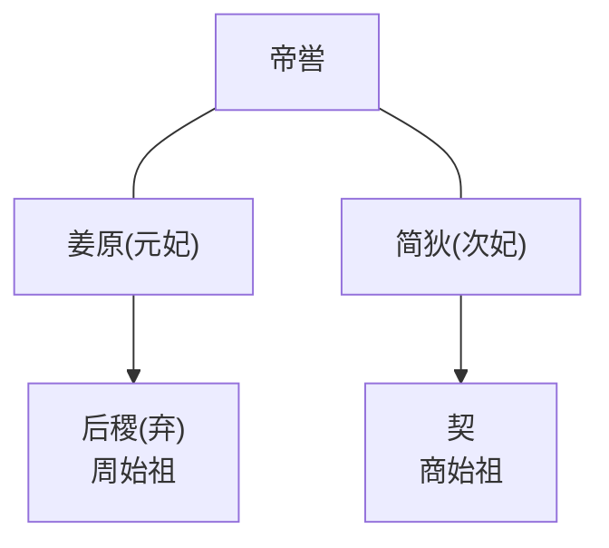
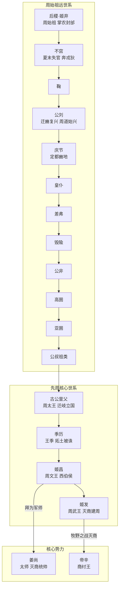
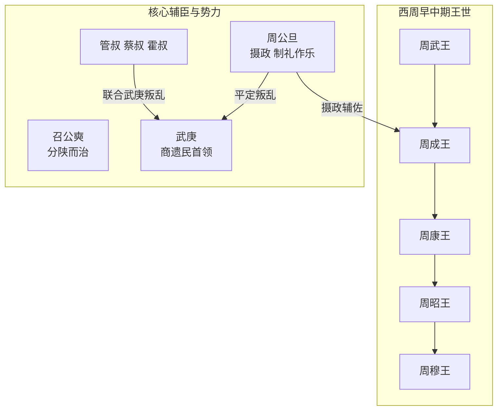
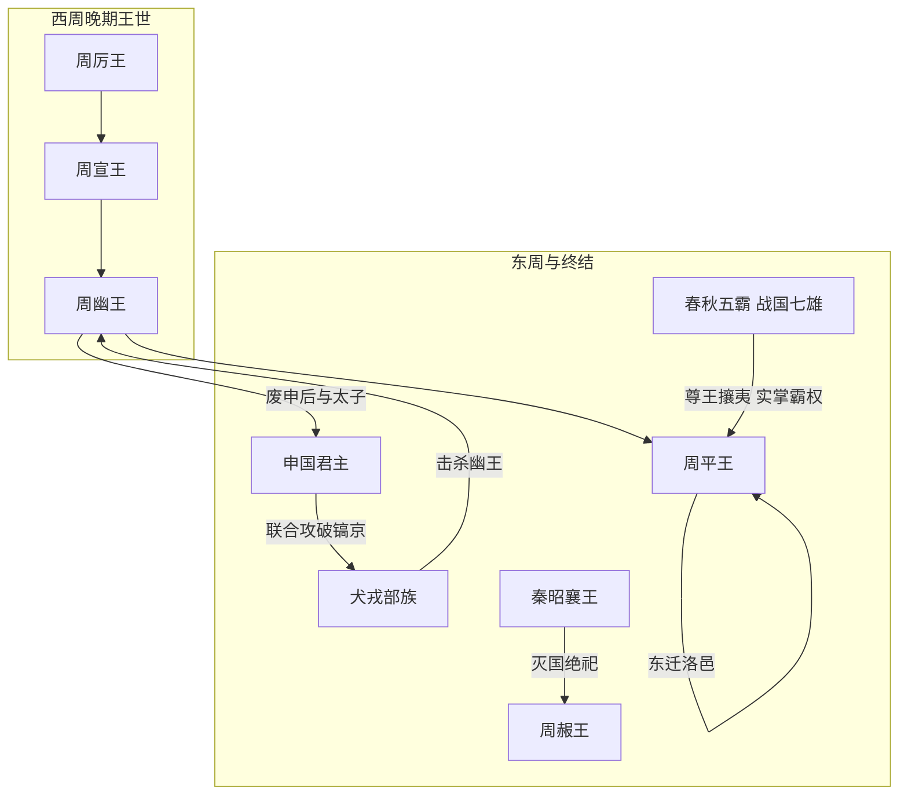

#  奠基

> 约公元前 12 世纪 — 公元前 1046 年

## 主要人物关系

> 与商朝关系

## 故事简述

周族是兴起于渭水流域的古老部族，相传为**帝喾后裔**，始祖**弃**（**后稷**）在尧舜时期执掌农业，被后世尊为农神

> 周的甲骨文类似“田”，可能此时改号为周

> 传说有一日，姜嫄趋郊信步而游，碰见一个巨人足印，其大小远胜常人，正惊疑问，顿觉一股暖流在气海泉涌，冲击遍身穴位，竟有说不出的畅快和舒坦，并莫名地产生一种踩踏这个大足迹的强烈欲望。她将她的脚套在巨人足印的大拇指上，俄顷，就感到腹中微动，好似胎儿动作一般。她又惊又怕，却毫无办法，十月后产下一子，姜嫄以为儿子是妖，就把他抛入隘巷；可一连串奇怪的现象发生。起先是隘巷中过往牛马都自觉避开，绝不踩到婴儿身上。后来姜原派人把他丢到山林中去，可正巧碰上山中人多没丢成。最后将婴儿抛到河冰上，又忽然飞来一只大鸟，用自己丰满的羽翼把婴儿盖住，以防婴儿冻僵。姜嫄得知后，以为这是神的指示，便将婴儿抱回精心抚养。因最初本是要抛弃他；所以给他起名叫“弃”

**不窋**（zhú）时，太康去稷不务，于是举族搬迁到戎狄
- 戎：西方少数民族泛称
- 狄：北方少数民族泛称

**公刘**时期迁居豳（bīn）地，发展农耕、营建城邑，部族逐步壮大

商朝晚期，**古公亶（dǎn）父**为躲避戎狄侵扰，率部族迁至==岐山==脚下的==周原==，营建城郭、设立职官、改革戎狄旧俗，正式建立早期国家形态，周族由此进入快速发展阶段，古公亶父也被后世尊为周太王

> 率西==水浒==，至于岐下
> > 引申：出路，安身之意
> 
> 
> 迁至周原，可能此时改号为周

设置五官：
- **司徒**
    核心职权：土地、民政
    现代类比：民政部
- **司马**
    核心职权：军政、军队
    现代类比：军队
- **司空**
    核心职权：工程、营建
    现代类比：住建部
- **司士**
    核心职权：爵禄、官吏管理
    现代类比：组织部
- **司寇**
    核心职权：治安、刑狱
    现代类比：公安部

古公亶父死后，幼子**季历**继位：

> 太伯、虞仲为让季历继承，放弃继承权，去到江南建立吴国

季历励精图治，多次率军征伐周边戎狄，疆域大幅扩张，成为商朝西方最强的方国，引起商王文丁忌惮，最终==被文丁囚禁杀害，商周结下世仇==

季历之子**姬昌**继位：（周文王）
他继承父业，广施仁政、招纳贤才，姜尚等天下贤士纷纷归附
对内发展农业、推行德治，周边方国纷纷归附，形成 “三分天下有其二” 的格局
姬昌晚年攻灭崇国，迁都丰邑（今陕西西安西南），完成了对商都的战略包围

姬昌去世后，其子**姬发**继位：（周武王）
武王以姜尚为太师，周公旦为辅佐，继承文王灭商大业
约公元前 1048 年，武王率军在孟津大会诸侯，史称 “孟津观兵”，八百诸侯不期而会，反商联盟正式形成
两年后，趁商朝主力东征东夷、朝歌空虚之机，武王率诸侯联军伐商，于牧野与商军决战，商军奴隶阵前倒戈，周军直入朝歌，帝辛自焚而死，商朝灭亡
武王正式建立周王朝，定都镐京，史称西周

#  繁荣

> 约公元前 1046 年 — 公元前 841 年
## 主要人物关系

## 故事简述

武王克商后仅两年便去世，年幼的成王继位，由武王之弟周公旦摄政代行王权。此举引发管叔、蔡叔、霍叔等宗室贵族不满，他们联合商纣王之子武庚及东方奄、蒲姑等方国发动叛乱，史称 “三监之乱”。周公旦率军二次东征，历时三年平定叛乱，诛杀武庚、管叔，流放蔡叔，攻灭东方十七国，彻底肃清了商朝残余势力，将周王朝的统治范围扩展到黄河下游与江淮流域。

平叛之后，周公旦主持营建东都洛邑（今河南洛阳），将商朝遗民迁徙至此集中管控；同时系统制定礼乐制度，确立了分封制、宗法制、井田制与礼乐等级体系，通过 “封邦建国” 将宗室子弟、功臣与先代贵族分封到各地建立诸侯国，以血缘宗法为纽带构建起层层隶属的统治秩序，奠定了周朝八百年基业。周公摄政七年后还政于成王，开创了后世尊崇的圣贤典范。

成王与康王两代，继承周公制定的制度，轻徭薄赋、与民休息，政治清明、社会安定，史载 “成康之际，天下安宁，刑错四十余年不用”，史称 “成康之治”，是西周王朝的鼎盛阶段。康王之后，昭王继位，多次率军南征楚荆，将西周疆域拓展至江汉流域；穆王在位时期，西征犬戎、东伐徐夷，疆域达到西周最大范围，同时命吕侯制定《吕刑》，完善了西周的法律体系。昭穆时期，西周王朝国力强盛、文化远播，礼乐文明达到顶峰。

**考古与学术实证**：

1. 陕西宝鸡出土的**何尊**铭文最早出现 “宅兹中国” 四字，记载了周成王营建洛邑、治理天下的史实，是 “中国” 一词的最早实物见证，直接印证了西周初年的都邑营建与疆域观念。
2. **大盂鼎**铭文详细记载了周康王对贵族盂的册封与赏赐，内容涉及西周的官制、军制、祭祀制度，印证了分封制与宗法等级体系的成熟。
3. 北京房山琉璃河燕国遗址、山西曲沃天马 - 曲村晋国遗址，分别为西周初期分封的燕、晋两国都邑，出土大量带铭文的青铜礼器，证实了分封制在全国范围的推行，是西周王朝统治体系的实物佐证。
4. 周原遗址出土的西周甲骨卜辞、宫殿宗庙建筑群，以及丰镐遗址的大型礼制建筑，反映了西周早中期王朝的强盛国力与完备的祭祀、行政体系。
5. 本阶段制度与史事为《史记・周本纪》《尚书・周书》《周礼》等文献系统记载，经金文与考古遗存双重印证，是官方历史叙事中西周礼乐文明的核心内容。

#  衰败

> 约公元前 841 年 — 公元前 256 年

## 主要人物关系

## 故事简述

西周王朝的衰落始于周厉王时期。厉王贪图财利，任用荣夷公垄断山林川泽之利，禁止民众进入谋生，同时压制舆论，派人监视国人言论，导致民众 “道路以目”。公元前 841 年，镐京国人发动暴动，驱逐周厉王，由召公、周公共同执政（一说由共伯和执政），史称 “共和行政”。**共和元年（公元前 841 年）是中国历史有确切连续纪年的开端**，此后中国历史再无年代断层。

厉王死后，宣王继位。宣王前期整顿朝政、修复礼制，对外征伐戎狄，短暂恢复了王朝国力，史称 “宣王中兴”。但宣王晚年对外战争接连失利，尤其是千亩之战中周军全军覆没，王朝军力大损；同时频繁干预诸侯废立，导致王室与诸侯矛盾加剧，中兴仅为回光返照。

宣王之子幽王继位后，西周统治彻底崩溃。幽王宠信褒姒，废黜申后与太子宜臼，改立褒姒之子伯服为太子，引发宗室与诸侯强烈不满。公元前 771 年，申侯联合缯国与犬戎攻破镐京，幽王被杀于骊山之下，西周灭亡。诸侯拥立太子宜臼继位，即周平王。因镐京残破且处于戎狄威胁之下，公元前 770 年，平王将都城东迁至洛邑，史称东周。

平王东迁后，周王室直接控制的疆域大幅缩水，军力、财力急剧衰退，周天子失去了天下共主的实际权威，进入 “礼乐征伐自诸侯出” 的春秋战国时代。春秋时期，齐桓公、晋文公等霸主以 “尊王攘夷” 为旗号争霸天下，周天子仅作为名义上的共主存在；战国时期，韩赵魏三家分晋、田氏代齐，七雄并立，周王室彻底沦为蕞尔小国，还分裂为东周、西周两个小公国。公元前 256 年，秦昭襄王出兵攻灭西周国，周赧王病逝，周朝祭祀断绝，享国近八百年的周王朝正式终结